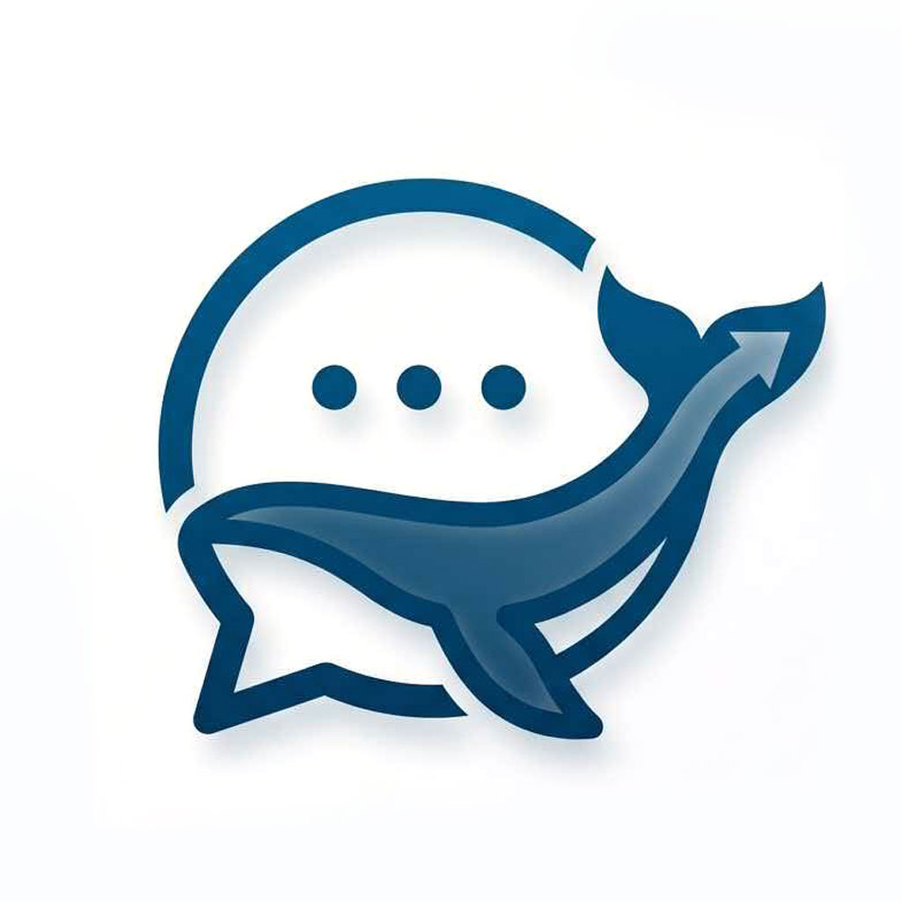

<div align="center">



# 鲸语 WhaleChat

基于 HarmonyOS 原生开发的 AI 智能对话助手，纯 ArkTS / ArkUI 实现，支持多模型接入、端云同步与永久记忆。

</div>

## ✨ 功能特性

- **多模型对话** — 支持 DeepSeek、OpenAI 等兼容 OpenAI 协议的 API，流式输出
- **多 API 配置管理** — 同时保存多套 API 配置，一键切换模型与供应商
- **深度思考** — 支持思维链（Reasoning）展示，默认折叠，可手动展开
- **Markdown 渲染** — 消息内完整渲染代码块、表格、列表等富文本内容
- **永久记忆** — 可让 AI 记住关键偏好与信息，跨对话生效
- **回收站** — 对话软删除，可恢复或彻底清除
- **端云同步** — 基于 AGC Cloud Kit 的分布式数据表，对话与记忆多设备同步
- **云备份 / 导入导出** — 本地数据云端备份，支持历史数据导入迁移
- **华为账号登录** — 基于 AccountKit UnionID 的账号体系

## 🛠 技术栈

| 项 | 说明 |
|---|---|
| 平台 | HarmonyOS（compileSdk 26 / compatibleSdk 24） |
| 语言 / UI | ArkTS + ArkUI 声明式开发范式 |
| 本地存储 | RelationalStore（RDB），分布式表端云同步 |
| 后端服务 | AGC Cloud Kit、AGC Auth、AccountKit |
| 依赖 | 仅华为官方 AGC 包（`@hw-agconnect/auth`），无其他第三方依赖 |

## 📁 项目结构

```
entry/src/main/ets/
├── entryability/    # EntryAbility 入口
├── pages/           # 页面：Chat / ConversationList / Memory / RecycleBin
│                    #       ApiConfig / ApiManagement / Login / Settings 等
├── components/      # ChatBubble、MessageInput、MarkdownView、ModelSelector 等
├── models/          # Message、Conversation、ApiConfig、Memory 数据模型
├── services/        # ApiService、StorageService、SyncService、CloudBackupService 等
├── common/          # Constants、Utils
└── utils/           # FileHelper 等工具
```

## 🚀 快速开始

1. 使用 **DevEco Studio** 打开本项目
2. 在 `File → Project Structure → Signing Configs` 中配置签名（自动签名即可）
3. 命令行构建 HAP：

   ```bash
   node "<DevEco Studio>/tools/hvigor/bin/hvigorw.js" assembleHap --mode module \
     -p module=entry@default -p product=default
   ```

4. 首次启动会引导进入 API 配置页，填入 DeepSeek / OpenAI 的 API Key 即可开始对话

> 云同步功能需在 AGC 控制台完成 Cloud Kit 容器与数据类型配置，详见 `AGENTS.md`。

## 📚 相关文档

- [NOTICE.md](NOTICE.md) — 开发避坑记录（编码错误与修复经验）
- [AGENTS.md](AGENTS.md) — AI 辅助开发项目记忆（架构约束、构建命令、规范）
- [REVIEW_REPORT.md](REVIEW_REPORT.md) — 代码审查报告
- [archive/](archive/) — 迭代存档与回滚说明

## 📄 License

本项目基于 [MIT License](LICENSE) 开源。
